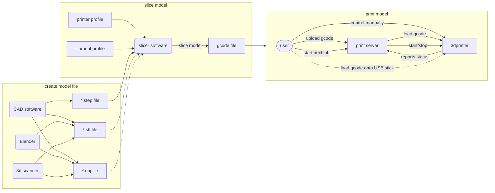

```mermaid
flowchart LR
    subgraph create_model_file[create model file]
    direction TB
        stl[*.stl file]
        step[*.step file]
        obj[*.obj file]
        cad(CAD software)
        blender(Blender)
        3dscan(3d scanner)
        
        cad --> step
        cad --> stl
        cad --> obj
        blender --> stl
        blender --> obj
        
        3dscan --> stl
        3dscan --> obj
    end
    
    subgraph slice_model[slice model]
        slicer(slicer software)
        printer_profile[printer profile]
        filament_profile[filament profile]
        gcode[gcode file]
        printer_profile --> slicer
        filament_profile --> slicer
        slicer -- slice model --> gcode
    end
    
    subgraph print[print model]
    direction LR
        print_server[print server]
        3dprinter
        user([user])
        print_server -- load gcode --> 3dprinter
        print_server -- start/stop --> 3dprinter
        3dprinter -- reports status --> print_server
        user -- control manually --> 3dprinter
        user -- upload gcode --> print_server
        user -- start next job --> print_server
        user -. load gcode onto USB stick .-> 3dprinter
    end
    
    step --> slicer
    stl -.-> slicer
    obj -.-> slicer
    gcode --> print
    
```
