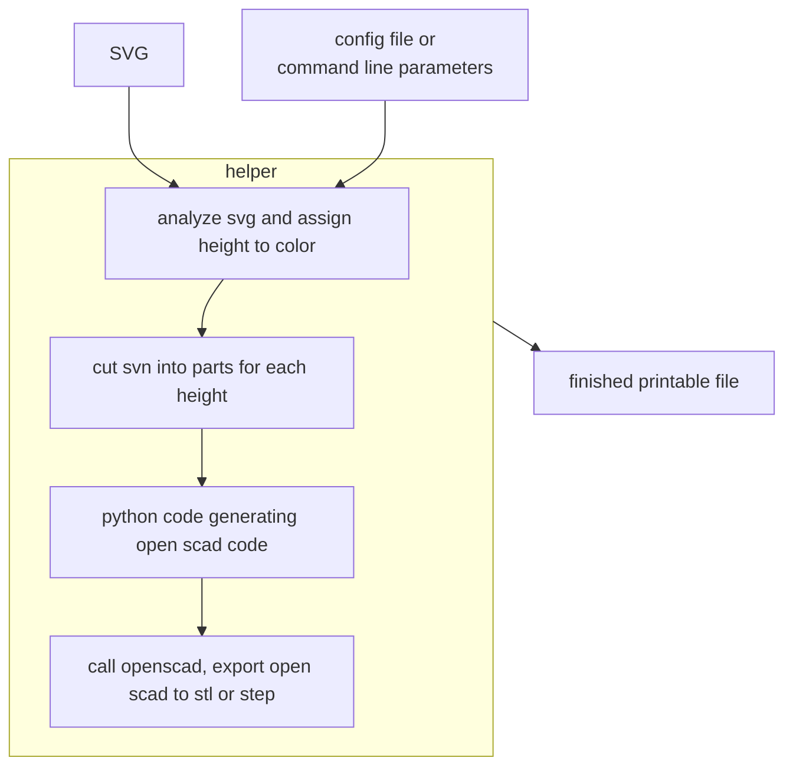

# Helper: SVG to 3dprint
## User story
I want to design flat model that is 3d-printable using color changes. Since
the print should be nice and smooth a vector format is desirable as an input;
SVG seems to be a good format since it can be created e.g. with Inkscape.

The workflow should look like this from the outside:

## Draft of implementation

